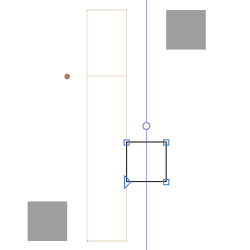

**About**

Python scripts for the [Glyphs font editor](http://glyphsapp.com/).

**Requirement**

- Glyphs
- Python

**Installing**

- Put the scripts into `~/Library/Application Support/Glyphs 3/Scripts` folder.
- Hold down the `Option` key and choose Script > Reload Scripts, or just press `Cmd` `Opt` `Shift` `Y` keys.

**Scripts**

# Align to Layer Horizontal Center

Align selection to horizontal center of the layer, also considering the italic angle.

The script does not change the sidebearings to align the content, but only changes the x-coordinates of the selected elements.

The key feature of this script is how it analyzes bounds if an italic angle is specified. Each node in a selection is analyzed (even within components) to find the left and right extremes, respected to italic angle. And these extremes give the left origin and the width of the slanted bounds.

If a group of objects of different types (nodes, components, anchors, guides) is selected, they will be aligned to the center of the layer as a group, keeping the distance between the group elements.

Shortcut suggestion: `Ctrl` `Shift` `A`

# Flip Horizontal

Flip selection (or layer) horizontal, set the new first node (lowest left) and correct path direction.

Shortcut suggestion: `Ctrl` `Shift` `F`

# Generate Kern Strings

Generate kern strings based on the Left and Right groups and add them into the Sample Texts. For example, for the left groups `C` `D` `c` `d` `three` `four` `.` `-` `c.sc` `d.sc` and right groups `A` `B` `a` `b` `one` `two` `.` `-` `a.sc` `b.sc` the kern strings will be:

- HH`A`CDcd34.-/c.sc/d.sc
- HH`B`CDcd34.-/c.sc/d.sc
- nn`a`CDcd34.-
- nn`b`CDcd34.-
- 00`1`CDcd34.-
- 00`2`CDcd34.-
- HH`.`CDcd34.-
- HH`-`CDcd34.-
- /h.sc/h.sc`/a.sc`/c.sc/d.sc
- /h.sc/h.sc`/b.sc`/c.sc/d.sc

The steps the script takes:

- Get unique left and right groups.
- Get one character attached to each group. Priority is given to characters whose name matches the name of the group. If the glyph don't have a character value (not a part of Unicode), the glyph name will be taken, like `/one.osf `.
- Sort the characters by `uppercase` `lowercase` `figure` `punctuation` `other` categories.
- Sort the characters inside these categories.
- Generate kern strings like `CC` `R` `LLLLLLLLL`, where `C` is a character to compare with (can be **HH** **nn** **00** **/h.sc/h.sc**), `R` is the one character from Right Groups (needed kerning to all the following ones), and `L` are all the characters from Left Groups (to kern with). For example, for the character `r` from Right Group, the first kern string may looks like: `nnrAHOJSTUVXYZaonftsuvxz01234589.?*-'//`.
- Add kern strings to the Sample Texts to the category named after the font family name.
- Open Edit view tab.
- Activate Text tool.
- Activate Show Group Members from View menu.
- Set kerning-only mode.
- Open Select Sample Texts panel and select the first string from added category.
- Set the caret position between the first kern pair (right after the main character).

# License

Copyright 2023 Michael Rafailyk (@michaelrafailyk).

Licensed under the Apache License, Version 2.0 (the "License"); you may not use the software provided here except in compliance with the License. You may obtain a copy of the License at

http://www.apache.org/licenses/LICENSE-2.0

See the License file included in this repository for further details.
