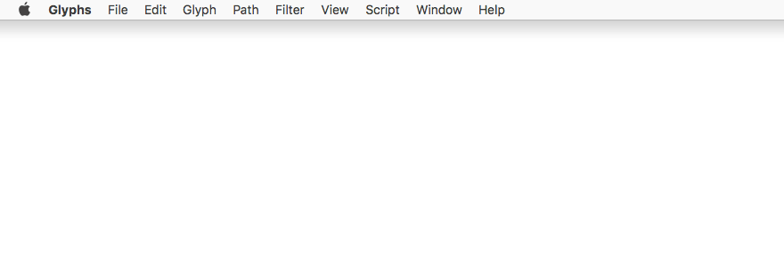

# About

Python scripts for the [Glyphs font editor](http://glyphsapp.com/).

# Requirement

- Glyphs
- Python

# Installing

- Put the scripts into `~/Library/Application Support/Glyphs 3/Scripts` folder.
- Hold down the `Option` key and choose Script > Reload Scripts, or just press `Cmd` `Opt` `Shift` `Y` keys.

# Scripts

## Generate Kern Strings

Generate kern strings based on the Left and Right groups and add them into the Sample Texts.

- Get unique left and right groups.
- Get one character attached to each group. Priority is given to characters whose name matches the name of the group. If the glyph don't have a character value (not a part of Unicode), the glyph name will be taken, like `/one.osf `.
- Sort the characters by `uppercase` `lowercase` `figure` `punctuation` `other`.
- Generate kern strings like `CC` `R` `LLLLLLLLL`, where `C` is a character to compare with (can be **HH** **nn** **00**), `R` is the one character from Right Groups (needed kerning to all the following ones), and `L` are all the characters from Left Groups (to kern with). For example, for the character `r` from Right Group, the first kern string may looks like: `nnrAHOJSTUVXYZaonftsuvxz01234589.?*-'//`.
- Add kern strings to the Sample Texts to the category named after the font family name.
- Open Edit view tab.
- Activate Text tool.
- Activate Show Group Members from View menu.
- Set kerning-only mode.
- Open Select Sample Texts panel and select the first string from added category.
- Set the caret position between the first kern pair (right after the main character).

# License

Copyright 2023 Michael Rafailyk (@michaelrafailyk).

Licensed under the Apache License, Version 2.0 (the "License"); you may not use the software provided here except in compliance with the License. You may obtain a copy of the License at

http://www.apache.org/licenses/LICENSE-2.0

See the License file included in this repository for further details.
